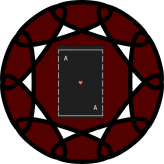

# Blackjack

|master|develop|
|:----:|:-----:|
|||

This is a simple Command Line Blackjack game written in ruby

To install the program, simply run

    gem install blackjack

Then start the program using the command `blackjack`

## Further Information

* [Changelog](CHANGELOG)
* [License (GPLv3)](LICENSE)
* [Gitlab](https://gitlab.namibsun.net/namibsun/ruby/blackjack)
* [Github](https://github.com/namboy94/blackjack)
* [Progstats](https://progstats.namibsun.net/projects/blackjack)
* [Rubygems](https://rubygems.org/gems/ruby-blackjack)
